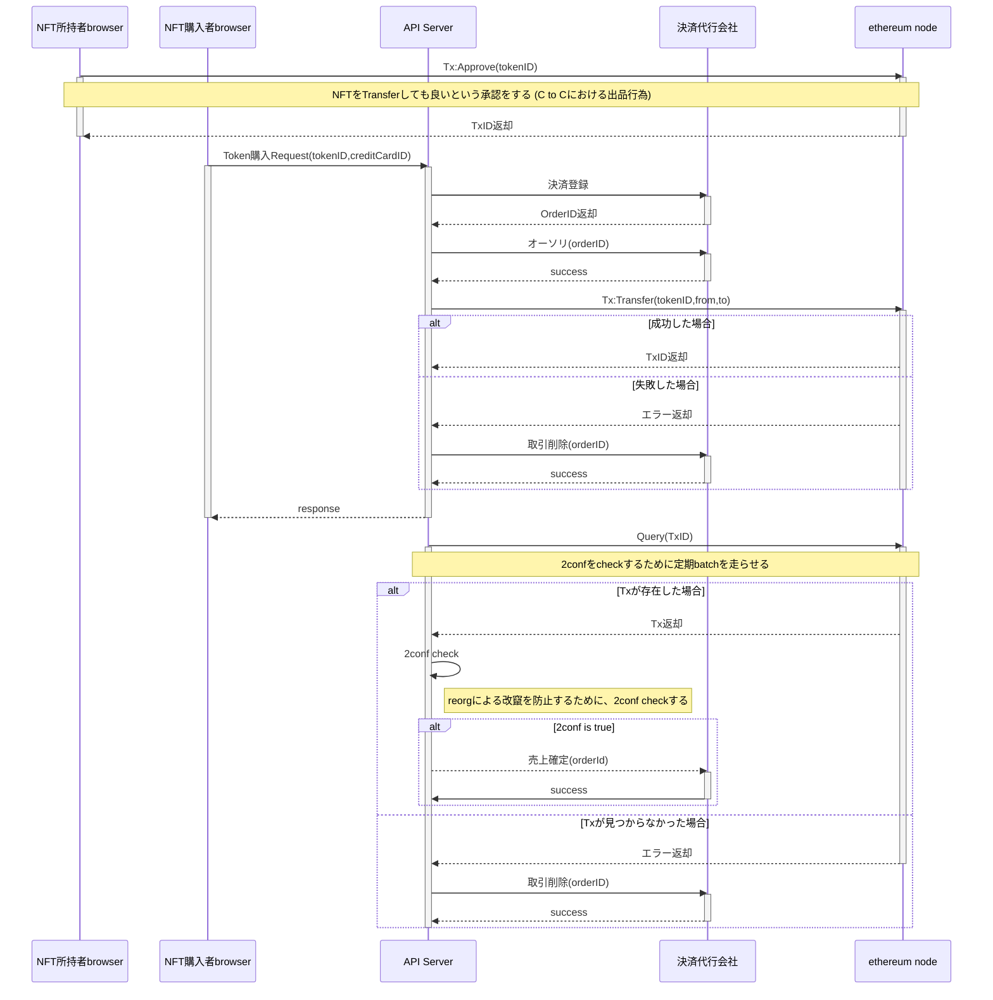

```mermaid
sequenceDiagram
participant app_token_owner as NFT所持者browser
participant app_token_buyer as NFT購入者browser
participant api as API Server
participant payment_provider as 決済代行会社
participant eth as ethereum node

app_token_owner->>eth: Tx:Approve(tokenID)
activate app_token_owner
activate eth
Note over app_token_owner, eth: NFTをTransferしても良いという承認をする (C to Cにおける出品行為)
eth-->>app_token_owner: TxID返却
deactivate eth
deactivate app_token_owner


app_token_buyer->>api: Token購入Request(tokenID,creditCardID)
activate app_token_buyer
activate api
api->>payment_provider: 決済登録
activate payment_provider
payment_provider-->>api: OrderID返却
deactivate payment_provider
api->>payment_provider: オーソリ(orderID)
activate payment_provider
payment_provider-->>api: success
deactivate payment_provider
api->>eth: Tx:Transfer(tokenID,from,to)
activate eth
alt 成功した場合
    eth-->>api: TxID返却
else 失敗した場合
    eth-->>api: エラー返却
    api->>payment_provider: 取引削除(orderID)
    activate payment_provider
    payment_provider-->>api: success
    deactivate payment_provider
end
deactivate eth
api-->>app_token_buyer: response
deactivate api
deactivate app_token_buyer

api->>eth: Query(TxID)
activate api
activate eth
Note over api, eth: 2confをcheckするために定期batchを走らせる
alt Txが存在した場合
    eth-->>api: Tx返却
    api->>api: 2conf check
    Note right of api: reorgによる改竄を防止するために、2conf checkする
        alt 2conf is true
            api-->>payment_provider: 売上確定(orderId)
            activate payment_provider
            payment_provider->>api: success
            deactivate payment_provider
        end
else Txが見つからなかった場合
    eth-->>api: エラー返却
    deactivate eth
    api->>payment_provider: 取引削除(orderID)
    activate payment_provider
    payment_provider-->>api: success
    deactivate payment_provider
end
deactivate api
```
