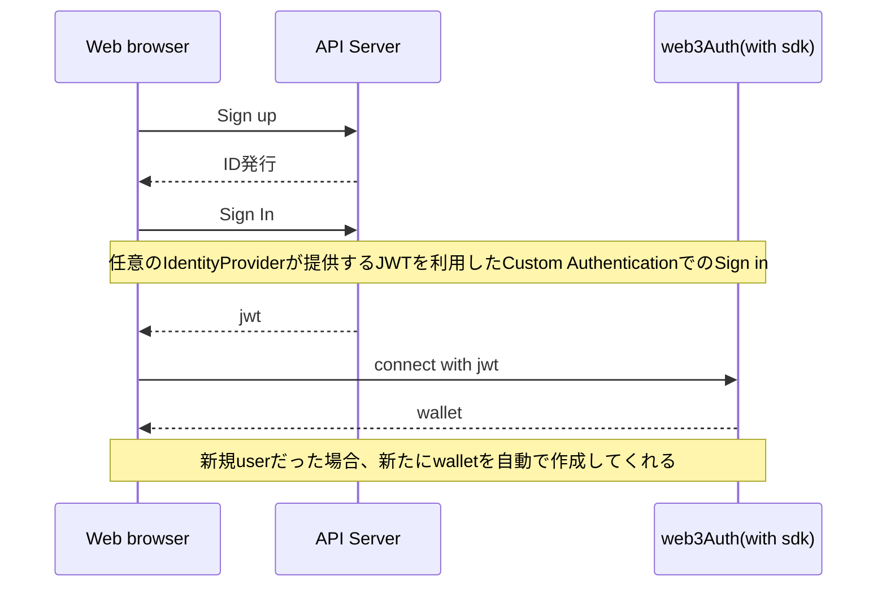

```mermaid
sequenceDiagram
participant app as Web browser
participant api as API Server
participant web3 as web3Auth(with sdk)

app->>api: Sign up
api-->>app: ID発行
app->>api: Sign In
Note over app, web3: 任意のIdentityProviderが提供するJWTを利用したCustom AuthenticationでのSign in
api-->>app: jwt
app->>web3: connect with jwt
web3-->>app: wallet
Note over app, web3: 新規userだった場合、新たにwalletを自動で作成してくれる
```